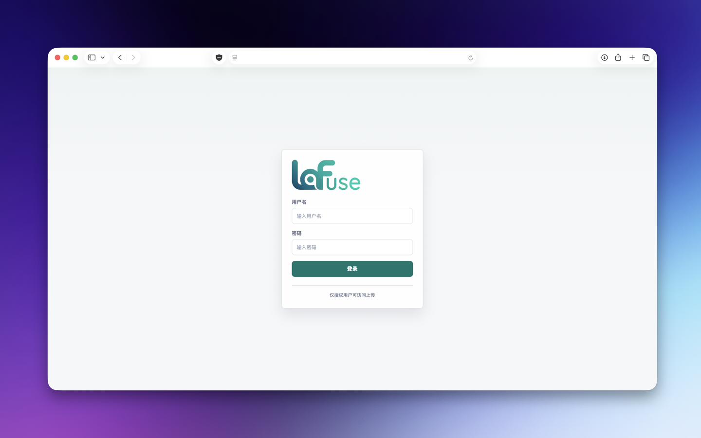

# Lafuse

Lafuse 是一个基于 Cloudflare Workers、R2、D1 和 KV 的轻量资源图库。当前默认采用低成本模式：媒体访问尽量绕过 Worker，图库查询避免额外计数，上传链路默认不做查重，并为图片生成缩略图以降低图库浏览流量。

<p align="center">
  
</p>

## 部署

本地开发：

```bash
npx wrangler dev
```

新建 D1 数据库后初始化：

```bash
npx wrangler d1 execute d1media --local --file scripts/schema.sql
```

生产发布：

```bash
npx wrangler secret put AUTH_SALT --env production
./scripts/deploy.sh
```

发布脚本会把 `APP_VERSION` 注入 Worker。默认版本号来自 `git describe --tags --always --dirty`：有 tag 时显示 tag，tag 后继续提交时显示 `v1.0.0-3-gabcdef0`，没有 tag 时显示 commit 号。

创建版本 tag 示例：

```bash
git tag v1.0.0
git push origin v1.0.0
./scripts/deploy.sh
```

## PicGo

Lafuse 提供独立的 Token 上传接口给 PicGo 使用，不复用网页登录 Session：

```http
POST /api/v1/upload
Authorization: Bearer <lafuse-api-token>
```

已有生产 D1 只需要初始化一次 Token 表：

```bash
npx wrangler d1 execute d1media --env production --remote --file scripts/init_api_tokens.sql
```

如果是从旧版本升级到带上传来源字段的版本，生产 D1 还需要执行一次：

```bash
npx wrangler d1 execute d1media --env production --remote --file scripts/init_upload_source.sql
```

管理员在 Web 后台的 `Token` 页面创建和撤销上传 Token。Token 上传者固定为创建 Token 的当前登录用户，不允许从客户端自由填写，避免污染图库归属和上传者筛选。后台只保存 Token hash，明文 Token 只在创建成功后显示一次。系统不记录 `last_used_at`，避免每次 PicGo 上传额外写 D1。

PicGo CLI 本地插件安装流程：

```bash
cd ~/.picgo
npm install --legacy-peer-deps <repo-path>/picgo-plugin-lafuse
```

PicGo Core 只会从 `~/.picgo/package.json` 的依赖项和 `~/.picgo/node_modules/` 加载 `picgo-plugin-*`，所以仅把插件目录放在项目里不会生效。

安装后确认上传器列表中包含 `lafuse`：

```bash
node -e "const { PicGo } = require('picgo'); const p = new PicGo(require('node:path').join(process.env.HOME, '.picgo/config.json')); console.log(p.helper.uploader.getIdList())"
```

PicGo 配置文件位于 `~/.picgo/config.json`，可以参考 `picgo-plugin-lafuse/config.example.json`：

```json
{
  "picBed": {
    "uploader": "lafuse",
    "current": "lafuse",
    "lafuse": {
      "endpoint": "https://lafuse.example.com",
      "token": "lafuse_v1_xxxxxxxxxxxx_xxxxxxxxxxxxxxxxxxxxxxxxxxxxxxxx"
    }
  },
  "picgoPlugins": {
    "picgo-plugin-lafuse": true
  }
}
```

配置完成后再测试上传：

```bash
picgo u /path/to/image.png
```

接口写入路径和网页上传一致：一次 R2 原图写入、一次 D1 记录写入；不额外走 Worker 媒体代理。Token 校验在 Worker 内有短 TTL 内存缓存，连续上传多张图片时会减少重复 D1 读。

## 配置

| 变量名 | 必填 | 默认值 | 说明 |
| :--- | :---: | :--- | :--- |
| `R2_BUCKET` | 是 | - | R2 存储桶绑定 |
| `DATABASE` | 是 | - | D1 数据库绑定 |
| `KV_NAMESPACE` | 是 | - | 登录失败限流 KV |
| `DOMAIN` | 是 | - | Worker 应用域名 |
| `AUTH_SALT` | 是 | - | 会话和密码散列盐，生产必须用 secret |
| `APP_VERSION` | 否 | `dev` | 界面展示版本号，推荐由 `scripts/deploy.sh` 自动注入 |
| `MEDIA_PUBLIC_ORIGIN` | 生产低成本模式必填 | - | R2 公开域名或自定义域名，用于让媒体文件绕过 Worker |
| `LOW_COST_MODE` | 否 | `1` | 开启低成本默认策略 |
| `MAX_SIZE_MB` | 否 | `10` | 单文件上传大小限制 |
| `ENABLE_UPLOAD_DEDUPE` | 否 | `0` | 上传前 SHA-256 查重，会增加 D1 读请求 |
| `HASH_MAX_MB` | 否 | 低成本 `20` | 启用查重时的最大 hash 文件大小 |
| `ENABLE_THUMBNAILS` | 否 | `1` | 上传时生成图片缩略图，会增加 R2 写入和少量存储，但降低图库浏览时的原图读取流量 |
| `ENABLE_VIDEO_THUMBNAILS` | 否 | `0` | 视频缩略图，默认关闭 |
| `ENABLE_TOTAL_COUNT` | 否 | `0` | 图库读取总数，会增加一次 D1 查询 |
| `SEARCH_MODE` | 否 | `prefix` | `prefix` 使用索引前缀搜索；`contains` 支持包含搜索但更贵 |
| `SEARCH_MIN_LENGTH` | 否 | `2` | 触发搜索的最小字符数 |
| `ALLOW_WORKER_MEDIA_PROXY` | 否 | 本地自动开启 | 生产强制允许 `/i/*`、`/t/*` 走 Worker 代理，仅调试建议使用 |

生产环境不要把 `AUTH_SALT` 写入 `wrangler.toml`，使用 `wrangler secret put AUTH_SALT --env production`。

## 低成本策略

- 媒体 URL 默认指向 `MEDIA_PUBLIC_ORIGIN`，图片和文件访问不进入 Worker。
- 低成本模式下 `/i/*`、`/t/*` 的 Worker 代理在生产默认关闭，避免错误配置导致每次看图都计 Worker 请求。
- 图库使用游标分页，避免 `OFFSET`。
- 默认不读取总数，列表接口只返回当前页和下一页游标。
- 默认生成图片缩略图：上传多一次 R2 写入和少量存储，图库浏览优先读取 `t/{id}.jpg`，避免列表页直接拉原图。
- 默认不做上传前查重，避免每个文件额外一次 `/api.exists` 和 D1 查询。
- 搜索默认使用 `original_name_lc` 前缀范围查询，避免 `LIKE '%keyword%'` 扫描。
- 上传者筛选来源改为 `users` 表，不再从 `media` 表 `DISTINCT username`。
- schema 使用 `scripts/schema.sql` 初始化，不在请求路径里做 `PRAGMA` 和 `CREATE INDEX`。

## 账号

用户账号保存在 D1 的 `users` 表中。密码散列为：

```text
sha256(AUTH_SALT + ":" + password)
```

新增用户时，用 `scripts/gen_user.sh` 按当前 `AUTH_SALT` 生成 SQL，不要提交真实用户 hash：

```sql
INSERT INTO users (username, password_hash, role)
VALUES ('admin', '<sha256-auth-salt-password>', 'admin');
```

重置已有用户密码：

```bash
./scripts/reset_user_password.sh --username admin
./scripts/reset_user_password.sh --env production --username admin --execute
```

脚本会隐藏读取 `AUTH_SALT` 和新密码。也可以通过环境变量传入 `AUTH_SALT`，但不要把真实 salt 写入仓库或命令行参数。

## License

MIT
